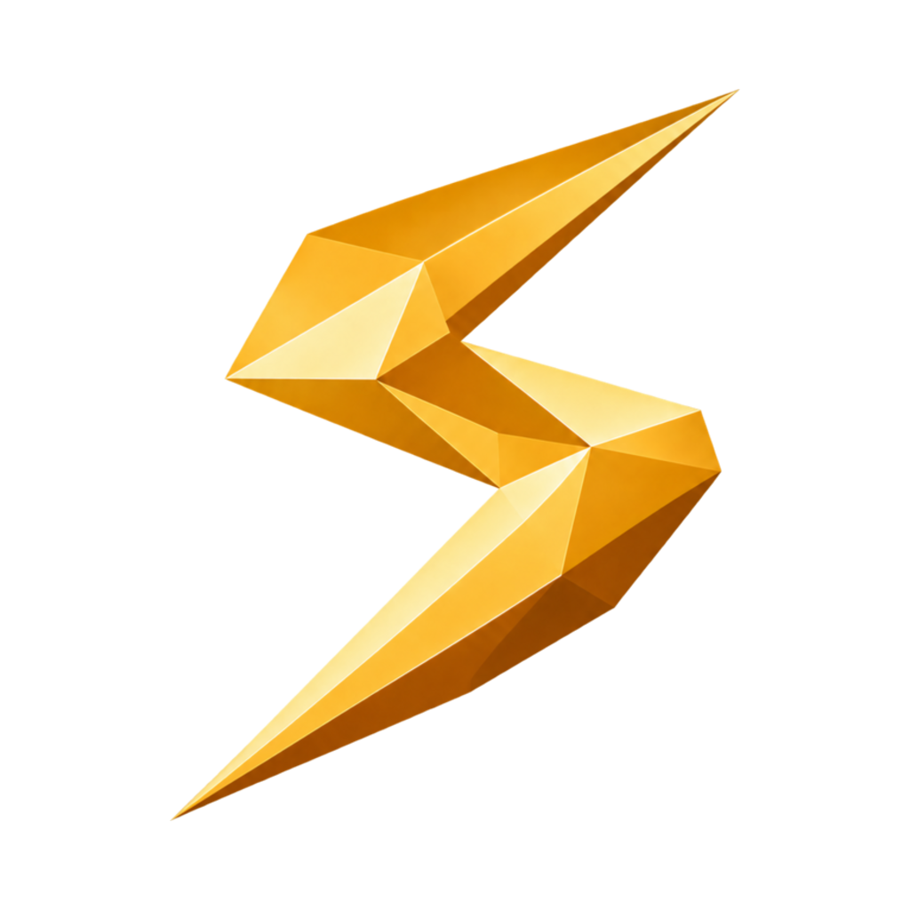
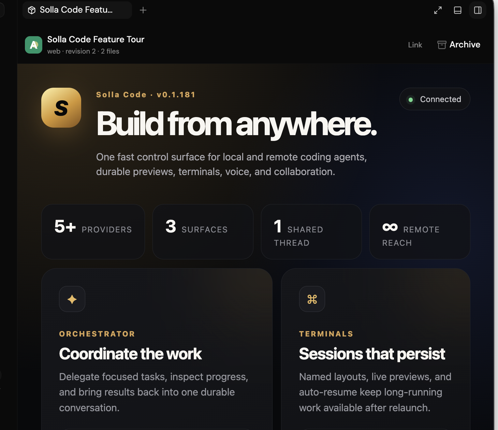
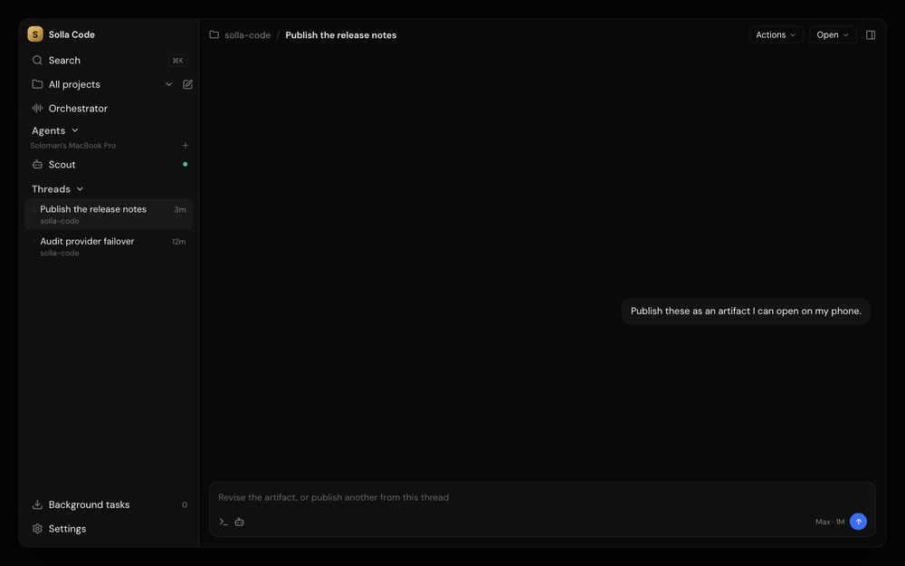
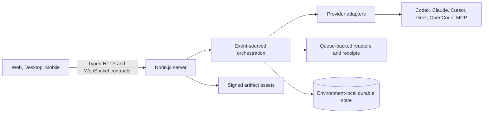

<p align="center">
  
</p>

<h1 align="center">Solla Code</h1>

<p align="center">
  A fast, open control surface for coding agents, available on desktop, web, and mobile.
</p>

<p align="center">
  <a href="https://github.com/sollaholla/t3code/actions/workflows/ci.yml?query=branch%3Amain"></a>
  <a href="./LICENSE"></a>
  <a href="https://github.com/sollaholla/t3code/releases"></a>
  <a href="#providers"></a>
  <a href="#clients-and-remote-access"></a>
  <a href="https://github.com/pingdotgg/t3code"></a>
</p>

<p align="center">
  <a href="#quick-start">Quick start</a> ·
  <a href="#what-solla-code-adds">Features</a> ·
  <a href="./docs/README.md">Documentation</a> ·
  <a href="./CONTRIBUTING.md">Contributing</a>
</p>

<p align="center">
  <a href="./docs/media/readme/solla-code-hero.png">
    
  </a>
</p>

Solla Code is an open source, bring-your-own-subscription workspace for running coding agents on a machine you control. One environment can serve a local desktop app, browsers on the network, and mobile clients, while durable threads keep the same work available across every connected surface.

Solla Code is built on the open core of [T3 Code](https://github.com/pingdotgg/t3code) from T3 Tools. This fork preserves T3 Code's performance-focused architecture and expands it with voice orchestration, persistent terminal workspaces, custom agents, collaboration, portable artifacts, and provider reliability tools.

## What Solla Code adds

| Capability                         | What it means in practice                                                                                                                                                                                                                                        |
| ---------------------------------- | ---------------------------------------------------------------------------------------------------------------------------------------------------------------------------------------------------------------------------------------------------------------- |
| **Voice orchestrator**             | Speak to a workspace-level agent that can inspect threads, route work, create focused threads, read terminals, and report results. OpenAI Realtime and Grok Voice use distinct saved credentials, so switching voice providers does not overwrite the other key. |
| **Persistent terminal workspaces** | Run agent CLIs or shells in up to four nested panes per group. Named layouts, retained PTYs, provider-specific session resume, drag and drop, and remote-safe rendering keep long-running terminal work useful after navigation or relaunch.                     |
| **Custom agents**                  | Give a named agent one durable conversation, tasks, an inbox, and a structured workspace artifact. Agents stay scoped to their connected environment and remain visible from remote clients.                                                                     |
| **Bounded collaboration**          | A root agent can ask another named agent for help or create a short-lived worker. Capabilities, delivery, questions, approvals, results, and cancellation stay visible without turning collaboration into unrestricted management.                               |
| **Thread artifacts**               | Publish revisioned web bundles, Markdown, images, PDFs, SVGs, or structured data from an ordinary chat. Signed host URLs make the same artifact available to authorized local, LAN, relay, and Tailscale clients.                                                |
| **Provider reliability**           | Typed provider status, usage reporting, scoped approvals, queued follow-ups, interruption, and usage-limit failover keep failures visible and recoverable.                                                                                                       |
| **External MCP providers**         | Connect a separately installed provider over the versioned `solla.provider-bridge/1` MCP contract, with negotiated models, health, capabilities, resumable sessions, and structured request handling.                                                            |
| **Remote-first clients**           | Operate the same environment through the Electron desktop app, the responsive web client, or the native mobile client. Environment-qualified routes prevent an agent or artifact from silently switching hosts.                                                  |

## See it in action

<p align="center">
  <a href="./docs/media/readme/thread-artifacts.gif">
    
  </a>
</p>

<p align="center"><sub>The screenshot above comes from the installed desktop app. This GIF is the same real, signed artifact bundle rendered from the Solla host, not a design mockup.</sub></p>

## Providers

Solla Code controls provider software that is already installed and authenticated on the host machine.

| Provider                                              | Host setup                                           | Notable integration                                                  |
| ----------------------------------------------------- | ---------------------------------------------------- | -------------------------------------------------------------------- |
| [Codex](https://developers.openai.com/codex/cli)      | Install Codex CLI, then run `codex login`            | App-server protocol, models, approvals, usage status, session resume |
| [Claude Code](https://claude.com/product/claude-code) | Install Claude Code, then run `claude auth login`    | SDK events, rate-limit status, approvals, session resume             |
| [Cursor](https://cursor.com/cli)                      | Install Cursor CLI, then run `cursor-agent login`    | Agent sessions and model selection                                   |
| [Grok Build](https://x.ai/cli)                        | Install Grok CLI, then run `grok login`              | Thought streaming, usage status, terminal session resume             |
| [OpenCode](https://opencode.ai)                       | Install OpenCode, then run `opencode auth login`     | Agent sessions and model selection                                   |
| [MCP Provider Bridge](./docs/providers/mcp-bridge.md) | Configure an absolute path to a trusted local bridge | Versioned capability negotiation for external providers              |

Provider-specific features are enabled only when an adapter or bridge advertises support. For example, typed automatic usage-limit failover currently recognizes explicit limit events from Codex, Claude Code, and Grok. Cursor and OpenCode remain available as providers, but ordinary errors do not trigger automatic failover.

## Clients and remote access

Solla Code keeps one environment authoritative for its projects, provider credentials, agents, threads, terminals, and artifacts. Clients connect to that environment instead of copying its state.

| Surface     | Best for                                           | Notes                                                                                                                                                             |
| ----------- | -------------------------------------------------- | ----------------------------------------------------------------------------------------------------------------------------------------------------------------- |
| **Desktop** | Hosting and full-time local work                   | Electron wraps the web client and adds desktop lifecycle, native dialogs, permissions, updates, and host integration.                                             |
| **Web**     | Local browsers, LAN access, Tailscale, and tunnels | The same-origin web app pairs with a server and supports responsive desktop and mobile browser layouts.                                                           |
| **Mobile**  | Monitoring and directing work away from the desk   | Native iOS and Android clients connect to existing environments, agents, threads, approvals, and artifacts. Terminal-mode threads remain chat-oriented on mobile. |

Remote connections use explicit pairing and environment-scoped identities. Thread artifact assets are served through short-lived signed URLs from the owning host. A remote browser can render an artifact without learning a private filesystem path, while authorization remains tied to the connected environment.

Read [Remote access](./docs/user/remote-access.md), [Custom agents](./docs/user/custom-agents.md), and [Thread artifacts](./docs/user/thread-artifacts.md) for the full behavior and trust boundaries.

## Quick start

### Build the Solla source tree

Use this route to run the current source in this repository.

1. Install the [Vite+ CLI](https://viteplus.dev/guide/).
2. Clone the Solla repository and install dependencies.

```bash
git clone https://github.com/sollaholla/t3code.git
cd t3code
vp i
```

3. Start the server and web client.

```bash
vp run dev
```

The development runner prints the actual local URLs and ports. Worktree state stays in that worktree's gitignored `.t3` directory by default.

To share a development environment over the tailnet, use:

```bash
vp run dev --share
```

Open the complete `pairingUrl` printed by the runner. The token is required, so a bare origin is not enough.

### Published Solla builds

Installers published by this fork are available on [Solla Code Releases](https://github.com/sollaholla/t3code/releases). A release badge reports the newest tag that GitHub currently exposes; the repository source can be newer than that published build.

### Official upstream T3 Code channels

The commands below install or run official upstream [T3 Code](https://github.com/pingdotgg/t3code) distributions. They are convenient for trying the upstream project, but they do not promise the current feature set of this Solla source tree.

| Platform                  | Upstream command                |
| ------------------------- | ------------------------------- |
| Any platform with Node.js | `npx t3@latest`                 |
| macOS with Homebrew       | `brew install --cask t3-code`   |
| Windows with Winget       | `winget install T3Tools.T3Code` |
| Arch Linux with AUR       | `yay -S t3code-bin`             |

## Feature guide

### Orchestrator and voice

The orchestrator is one pinned agent for the workspace. It can read and search threads, inspect projects, list terminals, read visible terminal output, send messages, write to live terminals, create threads, rename or settle work, and perform higher-authority actions only when its configured authority allows them.

Spoken turns are recorded in the same durable orchestrator thread as typed turns. OpenAI Realtime uses WebRTC, while Grok Voice uses WebSocket PCM audio and a server-minted short-lived client secret. Long-lived voice keys stay on the server. Read [The orchestrator](./docs/user/orchestrator.md) and [Grok Voice setup](./docs/integrations/orchestrator-grok-voice.md).

### Terminal mode

Web and desktop threads can switch between chat and a full terminal workspace without changing thread identity. Pane topology and sizing persist separately from the PTY session. Inactive renderers can be released while server-side terminals continue running, and provider-specific resume records reconnect supported CLIs to the correct session after a relaunch.

Ordinary chats and the orchestrator can list open panes, identify their owning thread, read their current screen, and type into them through scoped terminal tools. Read [Terminal mode](./docs/user/terminal-mode.md).

### Agents and collaboration

Each named custom agent has a persistent chat plus Tasks, Artifact, Inbox, and Collaborate views. Server-side scheduling survives closed pages and restarts. Recurring work created or materially changed by an agent remains a draft until a user approves it.

Collaboration is bounded by the environment. A root agent can delegate to a compatible named agent on the same host or create an ephemeral worker for a focused task. Human questions and approvals return to the root thread. Read [Custom agents](./docs/user/custom-agents.md) and [Custom-agent architecture](./docs/architecture/custom-agent-workspaces.md).

### Artifacts

Thread artifacts are named, revisioned bundles owned by a thread. Web bundles render inside an opaque sandbox that blocks popups, downloads, forms, same-origin privilege, and top-level navigation. Mobile WebViews accept only the selected host's signed asset subtree.

This is separate from a custom agent's declarative Artifact view, which renders a safe schedule, metrics, checklist, table, timeline, or cards model. Read [Thread artifacts](./docs/user/thread-artifacts.md) and [Artifact architecture](./docs/architecture/thread-artifacts.md).

### Provider status, approvals, and failover

Provider adapters normalize native events into one typed orchestration model. Health, authentication, model availability, quota signals, approval requests, structured input, interruptions, and completion remain associated with their provider instance, session, and turn.

Automatic failover responds only to explicit account-limit events. It chooses another configured and eligible provider, preserves a compact handoff, and records when no target is available. Read [Provider failover](./docs/user/provider-failover.md), [Provider account switching](./docs/user/provider-account-switching.md), and [Provider architecture](./docs/architecture/providers.md).

## Architecture



The server converts typed client commands into persisted events, projects the read model that clients render, and delegates provider-specific complexity to adapter boundaries. Queue-backed reactors handle side effects such as provider commands and checkpoints. Typed receipts let orchestration and tests wait for real milestones instead of polling timers.

| Area                                                  | Location                                               |
| ----------------------------------------------------- | ------------------------------------------------------ |
| Server, WebSocket transport, providers, orchestration | [`apps/server`](./apps/server)                         |
| React web client                                      | [`apps/web`](./apps/web)                               |
| Electron desktop shell                                | [`apps/desktop`](./apps/desktop)                       |
| React Native mobile clients                           | [`apps/mobile`](./apps/mobile)                         |
| Shared wire schemas                                   | [`packages/contracts`](./packages/contracts)           |
| Shared web and mobile runtime                         | [`packages/client-runtime`](./packages/client-runtime) |
| Runtime utilities                                     | [`packages/shared`](./packages/shared)                 |

Start with the [Architecture overview](./docs/architecture/overview.md), [Connection runtime](./docs/architecture/connection-runtime.md), and [Encyclopedia](./docs/reference/encyclopedia.md).

## Documentation

- [Documentation index](./docs/README.md)
- [Getting started](./docs/getting-started/quick-start.md)
- [Remote access](./docs/user/remote-access.md)
- [Orchestrator](./docs/user/orchestrator.md)
- [Custom agents](./docs/user/custom-agents.md)
- [Terminal mode](./docs/user/terminal-mode.md)
- [Thread artifacts](./docs/user/thread-artifacts.md)
- [Provider guides](./docs/providers/codex.md)
- [CI operations](./docs/operations/ci.md)
- [Release operations](./docs/operations/release.md)

## Development and quality

The CI badge at the top reflects the latest `main` result reported by GitHub Actions. The workflow runs repository checks, tests, mobile native static analysis, and release smoke validation. See [CI operations](./docs/operations/ci.md) for the current pipeline.

During development, run the smallest focused proof for the behavior you changed:

```bash
vp test run path/to/focused.test.ts
vp lint --report-unused-disable-directives
vp fmt --check
```

Frontend changes should be verified on every affected surface. Provider-shaped changes need an explicit support decision for Codex, Claude Code, Cursor, Grok, OpenCode, and configured MCP bridges. Changes that cross the wire belong in `packages/contracts` and must be followed through server, web, desktop, and mobile consumers.

## Contributing

Read [CONTRIBUTING.md](./CONTRIBUTING.md) before proposing changes. Keep each contribution focused, preserve performance and remote behavior, include a targeted regression test for backend behavior, and attach real before and after media for user-visible UI work.

For the upstream project's community and support channels, visit [T3 Code](https://github.com/pingdotgg/t3code) and the [T3 Code Discord](https://discord.gg/jn4EGJjrvv).

## Credits

Solla Code is a downstream project built on [T3 Code](https://github.com/pingdotgg/t3code), created and maintained by [T3 Tools](https://t3.codes) and its contributors. The architecture, product principles, and substantial original implementation come from that open source project. Solla-specific work builds on that foundation with gratitude and preserves attribution in the repository history and license.

Thank you to the maintainers and contributors of T3 Code, Vite+, Effect, React, Electron, React Native, and the provider ecosystems that make this project possible.

## License

This repository is licensed under the [MIT License](./LICENSE).

Copyright (c) 2026 T3 Tools Inc.
