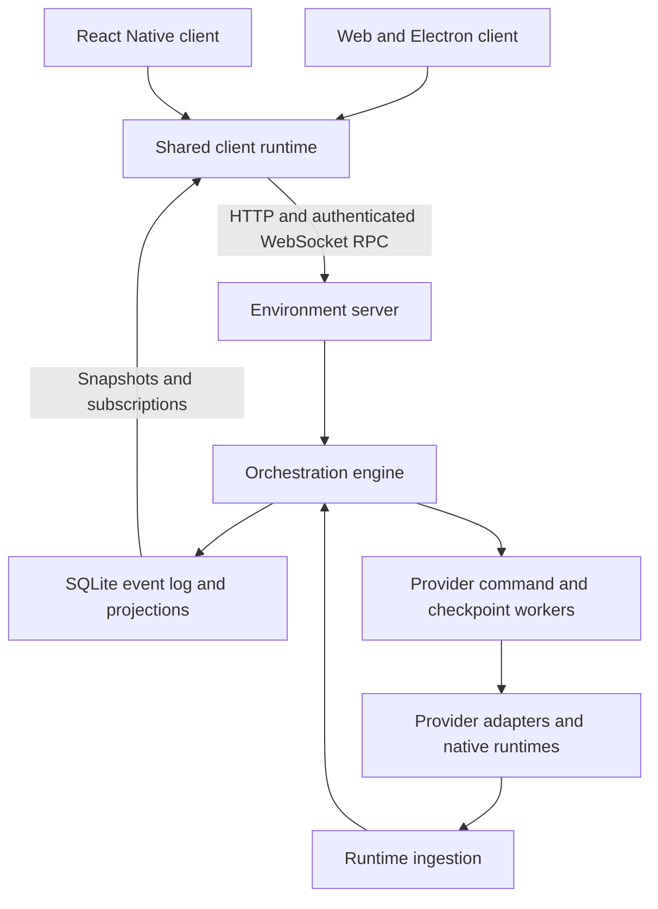

# Architecture

Solla Code is an independent fork of T3 Code. A Node.js server owns each environment's workspace access, provider processes, authentication, and durable conversation state. Web and Electron share the React client; the React Native mobile client connects through the same contracts and shared connection runtime.

## Connection ownership

The shared [connection runtime](./connection-runtime.md) owns environment registrations, authentication, retries, RPC sessions, and cached data. HTTP routes provide environment discovery, pairing, and history. Effect RPC provides typed operations and subscriptions over WebSocket. The contracts live in [`environmentHttp.ts`](../../packages/contracts/src/environmentHttp.ts) and [`rpc.ts`](../../packages/contracts/src/rpc.ts).

Each environment has its own connection and data scope. A connected socket does not imply that the shell or an individual thread has finished synchronizing. Clients keep those states separate and retain cached data while reconnecting. Desktop supplies platform integration and can host a bundled server; it can also connect to remote environments. See [remote architecture](./remote.md).

## Commands, events, and projections

1. A client operation constructs a typed orchestration command with a command ID.
2. The [engine](../../apps/server/src/orchestration/Layers/OrchestrationEngine.ts) runs the [decider](../../apps/server/src/orchestration/decider.ts), persists domain events, and updates projections. Command receipts provide idempotency.
3. The [provider command reactor](../../apps/server/src/orchestration/Layers/ProviderCommandReactor.ts) and durable work scheduler perform provider side effects.
4. [ProviderService](../../apps/server/src/provider/Layers/ProviderService.ts) routes work to an enabled provider instance. Adapters translate between the shared runtime contract and each provider's native transport.
5. [Runtime ingestion](../../apps/server/src/orchestration/Layers/ProviderRuntimeIngestion.ts) translates provider events back into orchestration commands. Clients observe the resulting shell and thread projections.

The provider transport is separate from client RPC. Codex uses its app-server protocol; other adapters use their respective SDK, ACP, HTTP, or external bridge transports. Driver registration and supported operations are described in [provider architecture](./providers.md) and the [provider index](../providers/README.md).

## Background work and Stop

Durable work obligations record queued deliveries, continuation, and recovery. Workers use scoped resources, typed receipts, and drain boundaries so tests can wait for an actual milestone rather than a timer.

Explicit Stop cancels outstanding deliveries and recovery for the thread, clears pending starts, interrupts the provider, and closes its session. The client also releases a held draft send. Late lifecycle events cannot reopen a stopped session. A new explicit send can start a fresh provider session using its persisted resume cursor. Internal provider handoffs retain their separate queued-message policy.

The [checkpoint reactor](../../apps/server/src/orchestration/Layers/CheckpointReactor.ts) records hidden Git checkpoints for diff and restore. A turn can finish producing text before checkpointing and other follow-up work finish; [runtime receipts](../../apps/server/src/orchestration/Layers/RuntimeReceiptBus.ts) distinguish these milestones.

## Related systems

- [Runtime and interaction modes](./runtime-modes.md)
- [Custom-agent workspaces](./custom-agent-workspaces.md)
- [Thread artifacts](./thread-artifacts.md)
- [Resource telemetry](./resource-telemetry.md)
- [Server updates and distribution ownership](./server-updates.md)
- [Terminology and source links](../reference/encyclopedia.md)

### User delivery admission

The durable work scheduler limits automatic work to twelve active turns globally and
six per provider by default, with a separate authentication recovery throttle. Explicit
user-message deliveries bypass the global and provider caps, but still acquire the
thread's exclusive runtime lease and contribute to the active counts. This prevents
long-running turns in other threads from indefinitely delaying a user send while
keeping automatic work from adding load when the provider is already busy. Scheduled
VM-agent prompts and synthetic continuation prompts do not receive this exemption.
